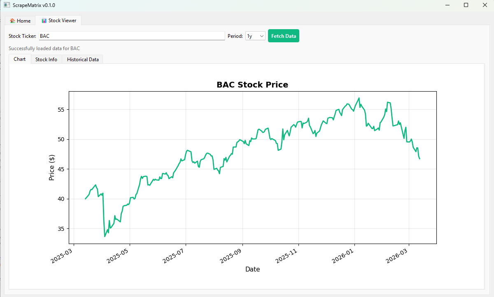

# ScrapeMatrix

Industrial-Grade Stock Analysis Desktop Application

## 📸 Application Preview



## ✨ Features

- 📈 **Real-time Stock Data** - Fetch live stock information using Yahoo Finance API
- 🎯 **Smart Ticker Suggestions** - Dynamic autocomplete with 70+ popular stocks
- 📊 **Interactive Charts** - Matplotlib integration for price visualization
- ⚡ **Non-blocking UI** - Background threading for responsive interface
- 🎨 **Professional Design** - PyQt6-based desktop application
- 🔄 **Threading** - Smooth data fetching without freezing UI

## 🚀 Quick Start

### Installation

```bash
pip install -e .
```

### Run Application

```bash
python -m scrapematrix
```

## 📚 Documentation

- [Start Here](./docs/START_HERE.md) - Quick overview
- [Quick Reference](./docs/QUICK_REFERENCE.md) - Common commands
- [How to Add Images](./docs/HOW_TO_ADD_IMAGES.md) - Guide for README
- [Complete Index](./docs/INDEX.md) - All documentation

## 🛠️ Technology Stack

- **Python 3.8+** - Programming language
- **PyQt6** - Desktop GUI framework
- **yfinance** - Stock data API
- **pandas** - Data manipulation
- **matplotlib** - Data visualization

---

## 🗂️ RAG Architecture (Planned)
```
rag_project/
├── data/                      # Raw documents (PDFs, text files)
├── vector_store/              # Local Vector DB storage (e.g., Chroma DB files)
├── src/                       # Main source code
│   ├── ingestion/             # Ingestion pipeline scripts
│   │   ├── loaders.py         # Functions to read PDFs/URLs
│   │   ├── chunkers.py        # Text splitting logic
│   │   └── embedder.py        # Pushing vectors to DB
│   ├── retrieval/             # Query pipeline scripts
│   │   ├── retriever.py       # Vector DB similarity search logic
│   │   └── generator.py       # LLM prompt construction and API calls
│   ├── api/                   # FastAPI endpoints
│   │   ├── routes.py          # /chat, /upload_doc endpoints
│   │   └── schemas.py         # Pydantic models for request/response
│   ├── config.py              # Environment variables and app settings
│   └── utils.py               # Helper functions (logging, error handling)
├── app.py                     # Streamlit frontend (if applicable)
├── main.py                    # FastAPI application entry point
├── requirements.txt           # Python dependencies
└── .env                       # API keys (OpenAI, Pinecone, etc.)

```

